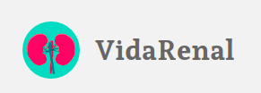

<h1 align="center">ENTERPRISE CHALLENGE - HEALTH & LIFE SCIENCES</h1>

Projeto desenvolvido para solucionar uma área da saúde utilizando o FHIR, da Microsoft.

  <a href="#-tecnologias">Tecnologias</a>&nbsp;&nbsp;&nbsp;|&nbsp;&nbsp;&nbsp;
  <a href="#-projeto">Projeto</a>&nbsp;&nbsp;&nbsp;|&nbsp;&nbsp;&nbsp;
  <a href="#-layout">Aplicação</a>&nbsp;&nbsp;&nbsp;|&nbsp;&nbsp;&nbsp;
  <a href="#-features">Novas Features</a>&nbsp;&nbsp;&nbsp;|&nbsp;&nbsp;&nbsp;
  <a href="#memo-licença">Licença</a>

  

 

  

## 🚀 Tecnologias

Esse projeto foi desenvolvido com as seguintes tecnologias:

- ReactJS
- SASS
- Material UI

## 💻 Projeto

A Plataforma VidaRenal é um projeto inovador e dedicado aos pacientes renais, oferecendo uma solução abrangente para ajudar no gerenciamento de seu tratamento e no acompanhamento de sua saúde de forma eficiente e conveniente.

Através da Plataforma VidaRenal, os pacientes renais têm acesso a uma variedade de recursos e funcionalidades que visam facilitar sua jornada de cuidados. Eles podem encontrar informações valiosas sobre seu tratamento renal, incluindo diretrizes dietéticas, recomendações de estilo de vida e dicas práticas para lidar com os desafios do dia a dia.

Um dos recursos principais da plataforma é a possibilidade de os pacientes registrarem suas anotações diárias. Eles podem fazer anotações sobre como se sentem, seus níveis de energia, sintomas e outros aspectos relevantes para o tratamento renal. Essas anotações ajudam os pacientes a acompanhar seu progresso ao longo do tempo e fornecem informações valiosas para eles e suas equipes médicas.

Além disso, a Plataforma VidaRenal permite que os pacientes acessem seus registros médicos e de enfermagem de forma segura e organizada. Eles podem visualizar consultas anteriores, resultados de exames, medicações prescritas, entre outros dados importantes. Isso proporciona uma visão abrangente do histórico médico e facilita a comunicação com os profissionais de saúde envolvidos no tratamento renal.

A segurança e privacidade dos pacientes são prioridades na Plataforma VidaRenal. Todos os dados são protegidos e armazenados de acordo com os mais altos padrões de segurança, garantindo a confidencialidade das informações pessoais e médicas.

A Plataforma VidaRenal é uma ferramenta indispensável para pacientes renais que desejam ter um melhor controle sobre seu tratamento, acompanhar seu progresso e acessar informações relevantes para sua saúde. É um ambiente seguro, informativo e interativo, projetado para promover a melhoria contínua da qualidade de vida e bem-estar dos pacientes renais.

## 🔖 Aplicação

Você pode visualizar a aplicação do projeto através [DESSE LINK](https://vaicomgulliver.netlify.app/)

## 📈 Novas Features

- [ ] Implementado responsividade.
- [ ] Implementar fhir-server.

## :memo: Licença

Esse projeto está sob a licença MIT.

---

Feito com ♥ by [Gisele Araujo Silva](https://www.linkedin.com/in/gisele-araujo-silva/) e [Vitória Ferreira](https://www.linkedin.com/in/vic-ferreira/)
